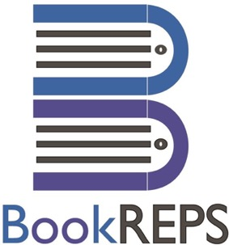

  

**Created by:**

- [Jugnu Misal](https://github.com/jugnumisal)
- [Ami Pandat]
- [Sambhav Jagnani]

as a group project for the **Year 2016-17**

# Introduction

### Problem Summary
- A platform which allows people to sell/buy/donate/exchange books is lacking.
- A platform through which buyers and sellers are directly connected without the need for a mediator, like bookstores.
- A platform through which buyers and sellers can get a good deal for old books in particular is lacking.

### Introduction to System:
BOOK REPS is a system that helps anyone to REPS (Request, Exchange, Post, Sell) the books. This system will help the almost all the people irrespective of their fields. This system has a special feature of posting an advertisement for any book that an individual is willing to sell or exchange or whatever be the offer. In today's busy and competitive world, everybody is busy in their own lives. They hardly have any time to spend on small chores like going to different bookstore in search for a book or purchasing a old/new book or selling an existing book. Mankind has already made a progress in online purchase of all kind of stuffs. To add time-saving features to all these existing systems, BOOKS REPS is made.

This system will have several features that will help simplify the work of an individual. There will be an online application that will be available for all to download on their smart phones. In order to adumbrate the system, consider an instance of a student of engineering studying in 7th semester. He needs to purchase his new semester books in exchange of his old semester books. Usually, all the students go to the bookstores that issue new books in exchange of the old ones. But this consumes precious time of an individual. To abstain from such time-consuming activities, BOOKS REPS comes in handy. The student will instead of going to a bookstore, can download an application to his smartphone and post a free advertisement for his books. He can post his offer and whoever interested can contact him directly. Not only the student can sell his previous semester books here, but also can purchase new semester books at affordable prices. This will help the student to get a decent value for his old books and can save money and time by purchasing new books online at affordable price.

This application has a user-friendly user-interface that is suitable for all. An individual is allowed to make his/her account and then will be able to access the full features of this application. An individual can add his/her contact information and can also manage the privacy settings. This application will not be useful for students only, but all the people irrespective of their fields. A passionate reader, who is interested in reading novels and fictional books, can also buy new books and sell his/her existing books on this system. Also, an individual can post an advertisement of giving books for free, thereby helping needy people. Thus, this system will also help spread humanity to a great extent.

### Aim & Objective
- Second hand books were not easily available at bookstore with fair price.
- Fair price of old books for buyers and sellers.
- Remove the bookstores as an intermediate phase and make direct contact between: the buyers and sellers.
- Ease the way of buying and selling books.
- Easy way to donate the books.

### Problem Specification
- Going to the bookstore by wasting petrol and time to sell old books and not getting the desired value seriously damages the resources without gaining any profit.
- A platform is needed to directly connect the sellers and the buyers, thus eliminating the mediator(bookstores).
- Mediators charge a certain amount in buying and selling old books. That amount can in the pockets of the buyers and sellers.
- A large number of buyers and seller can be connected through this platform without going to each and every bookstore and looking for the book.
- Interested buyers can contact the seller directly.
- Direct contact between the users (Buyers/Sellers) will save the time and other resources and thereby making the books exchange process easy.

